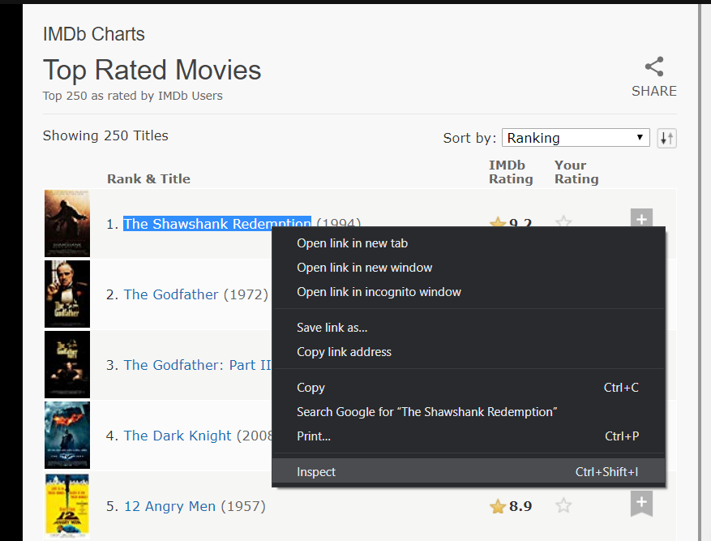
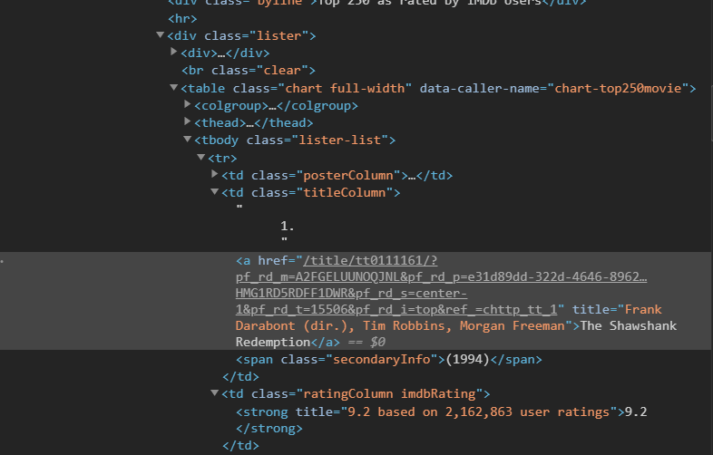
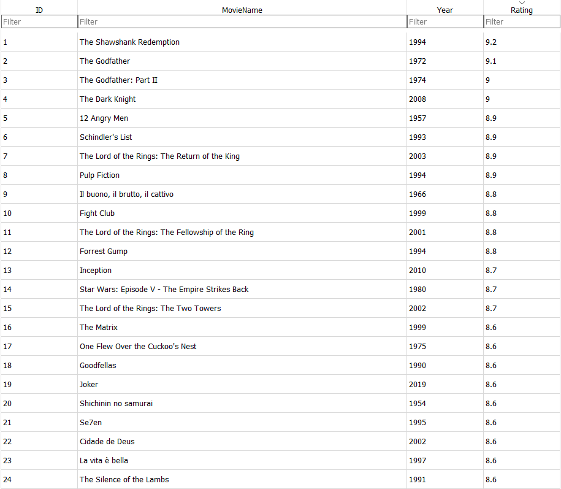

# Scraping the Top 250 Movies on IMDb

This program scrapes the top 250 movies on IMDb and arranges them in an SQL database.

## Contents
* [Installation](#installation)
* [How It Works](#how-it-works)

## Installation

This code requires Python 3.6 and above, to run and a Python IDE of your choice. Click [here](https://www.python.org/downloads/) to download Python.

To manage the databases, DB Browser for SQLite was used. Click [here](https://sqlitebrowser.org/dl/), if you want to download it.

This program requires the usage of the ```BeautifulSoup``` and the ```requests``` library.

```BeautifulSoup``` and ```requests``` can be installed by entering the following commands in your terminal/command line respectively:

```bash
pip install beautifulsoup4
pip install requests
```
```BeautifulSoup``` supports a variety of third-party parsers, like ```lxml```. To install ```lxml```, enter the following command in your terminal/command line:

```bash
pip install lxml
```

For more information about installing a web parser, click [here](https://www.crummy.com/software/BeautifulSoup/bs4/doc/#installing-a-parser).


## How It Works

### Libraries Used

First and foremost, the following libraries need to be imported:

```python
from bs4 import BeautifulSoup
import requests
import sqlite3
```

* ```BeautifulSoup```: A Python library for pulling data out of HTML and XML files. It works with your favorite parser to provide idiomatic ways of navigating, searching and modifying the parse tree.
* ```requests```: Allows you to send HTTP requests using Python. The HTTP request returns a Response Object with all the response data (content, encoding, status, etc).
* ```sqlite3```: A C library that provides a lightweight disk-based database that doesn’t require a separate server process. The database is accessible using a nonstandard variant of the SQL query language.

### Database

The SQL table contains 4 attributes (columns):


The database and table (MovieList) have been created in the Python code:

```python
conn = sqlite3.connect('imdbList.db')
cur = conn.cursor()
cur.execute('DROP TABLE IF EXISTS MovieList')

cur.execute('''
CREATE TABLE MovieList (ID INTEGER PRIMARY KEY AUTOINCREMENT,
                        MovieName VARCHAR(200),
                        Year YEAR,
                        Rating DEC(2,1))''')
```

### Scraping

```python
url = "https://www.imdb.com/chart/top"
resp = requests.get(url)
soup = BeautifulSoup(resp.text, features= 'lxml')
```
The URL for containing the top 250 movies has been saved as a string. ```request.get``` is used to request data from the server. ```resp``` acts as a file handle, and is passed into the ```BeautifulSoup``` constructor. ```soup``` contains the source code of the website.



Highlight one of the movie titles, right-click on it and select 'Inspect'.



As seen in the image above, the title of the movie, year of release and rating is located in ```<tbody class = 'lister-list'>```. All the 250 movies are stored within the aforementioned tag. Hence, as shown below, the variable ```tbody``` stores all the code within the tag.

```python
tbody = soup.find('tbody', class_='lister-list')
```
Within ```<tbody>```, the required information are in separate tags:

* The movie name is in ```<a>``` under ```<td class = 'titleColumn'>```
* The year of release is in ```<span class = 'secondaryInfo'>```
* The rating is in ```<strong>``` under ```<td class = 'ratingColumn imdbRating'>```

Since all of these are under ```<tr>```, we will scan through all the available ```<tr>``` under ```<tbody class = 'lister-list'>```.
Finally, at every interation of the loop, the information is stored accordingly into the 'MovieList' table.

```python
for tr in tbody.find_all('tr'):

    record = tr
    movieName = record.find('td', class_='titleColumn').a.text
    year = record.find('span', class_='secondaryInfo').text.strip('()')
    rating = record.find('td', class_='ratingColumn imdbRating').strong.text

    cur.execute("INSERT INTO MovieList (MovieName, Year, Rating) VALUES (?, ?, ?)", (movieName, year, rating))
    conn.commit()
```

### Final Result

The table will, after executing the program, will be displayed as shown below.


